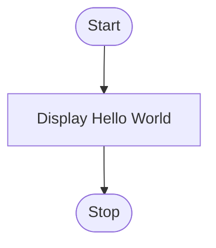
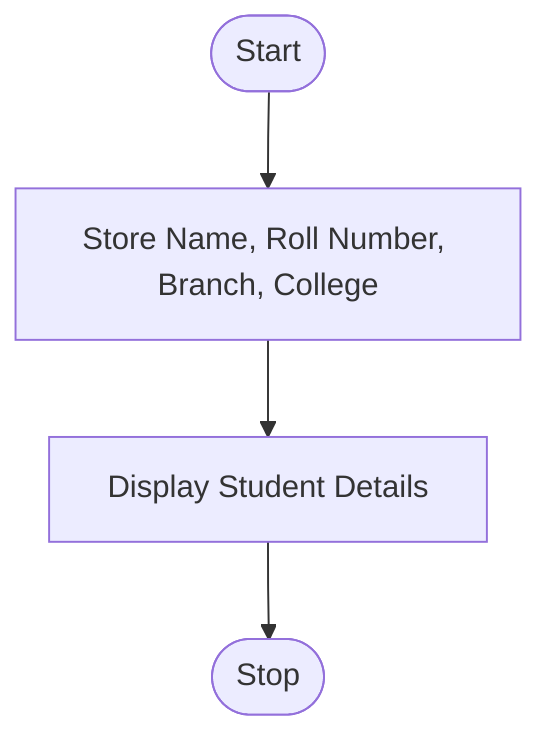
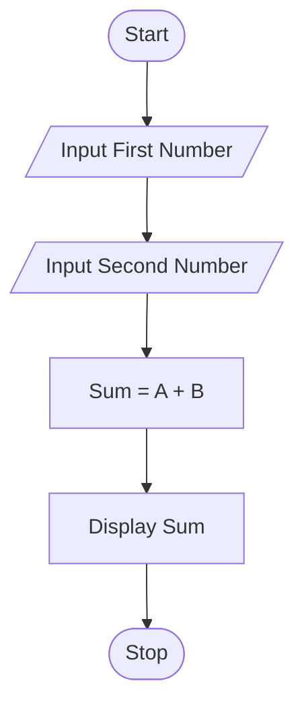
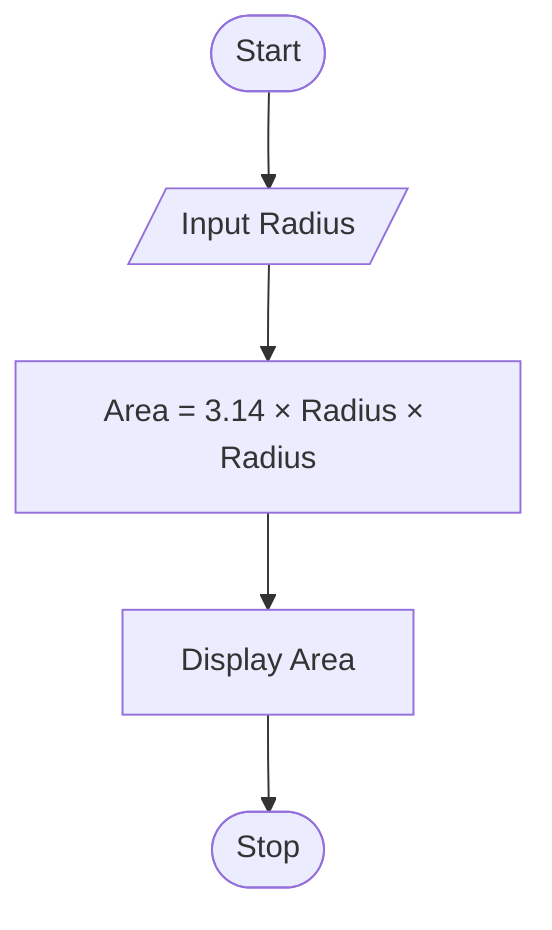
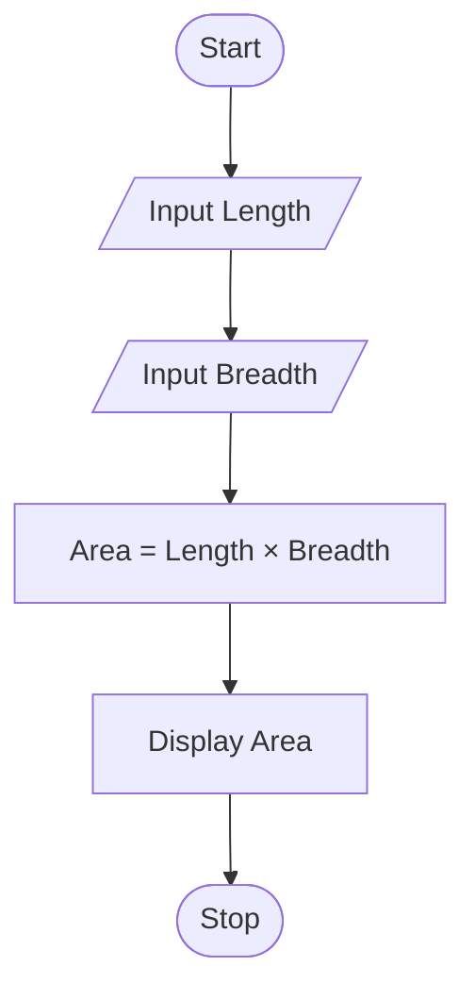
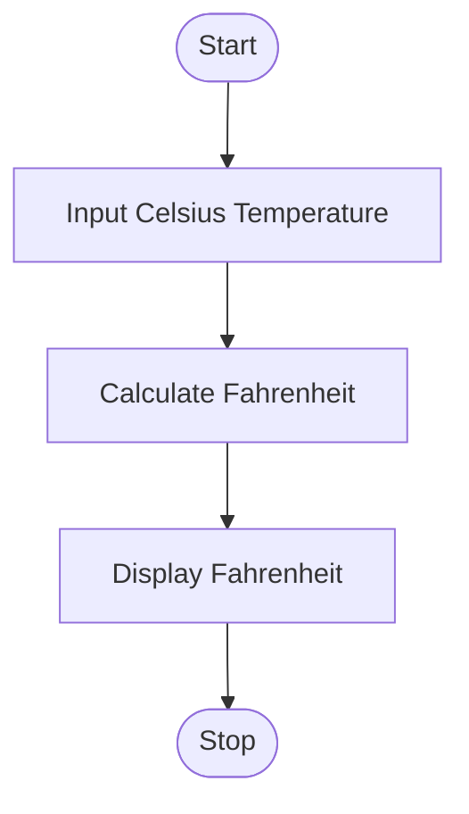
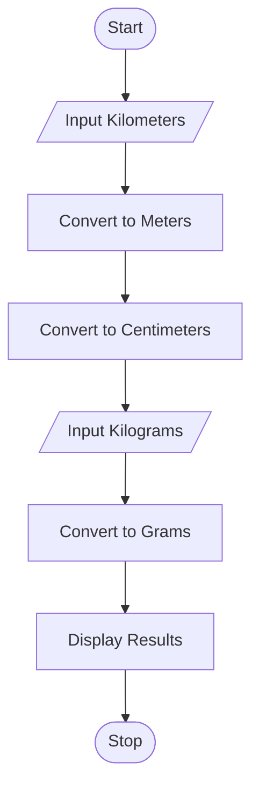
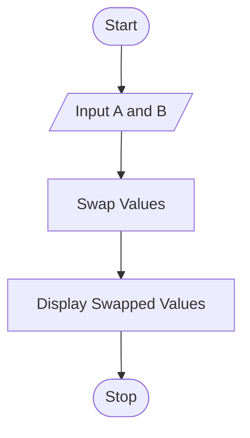
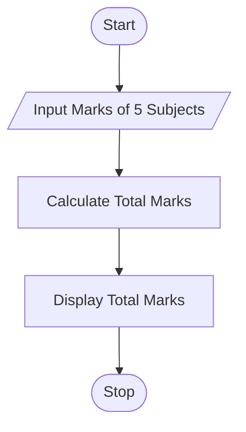
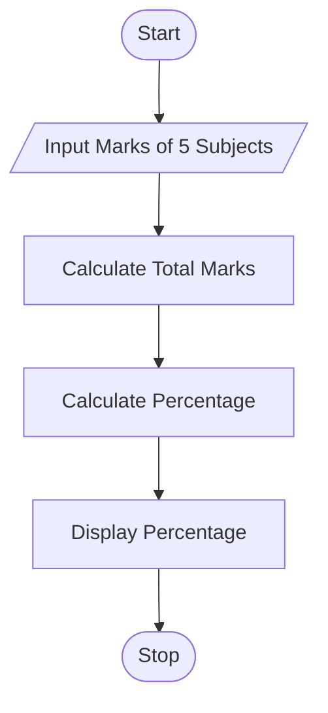

# Python Programming 

# Task 1: Hello World Program
## 1. Problem Statement

Write a Python program to display the message "Hello World" on the screen.

## 2. Algorithm
1. Start
2. Display the message "Hello World"
3. Stop

## 3.Flowchart




## 4. Python Source Code
```python
print("Hello World")
```
## 5. Sample Input/Output

Output:
Hello World

# Task 2: Personal Information Display

## 1. Problem Statement
Write a Python program to display a student's personal information including name, roll number, branch, and college name.

## 2. Algorithm
1. Start
2. Store student details
3. Display student details
4. Stop

## 3. Flowchart


## 4. Python Source Code

```python
name = "Bhargavi"
roll_no = "12345"
branch = "ECE"
college = "NRI Institute of Technology"

print("Name:", name)
print("Roll Number:", roll_no)
print("Branch:", branch)
print("College:", college)
```
## Output:
```python
Name: Bhargavi
Roll Number: 12345
Branch: ECE
College: NRI Institute of Technology
```

# Task 3: Addition of Two Numbers

## 1. Problem Statement

Write a Python program to read two numbers and display their sum.

## 2. Algorithm

1. Start
2. Read the first number
3. Read the second number
4. Add the two numbers
5. Display the sum
6. Stop

## 3. Flowchart



## 4. Python Source Code

```python
a = float(input("Enter first number: "))
b = float(input("Enter second number: "))

sum = a + b

print("Sum =", sum)
```

## 5. Sample Input/Output

Input:
10
20

Output:
Sum = 30.0


# Task 4: Area of Circle Calculation
 
## 1. Problem Statement

 Write a Python program to calculate the area of a circle for a given radius.

## 2. Algorithm
1. Start
2. Read the radius of the circle
3. Calculate the area using the formula: Area = π × r × r
4. Display the area
5. Stop
## 3. Flowchart



## 4. Python Source Code
```python
radius = float(input("Enter the radius: "))

area = 3.14 * radius * radius

print("Area of Circle =", area)
```
## 5. Sample Input/Output

Input:
5

Output:
Area of Circle = 78.5


# Task 5: Area of Rectangle Calculation
## 1. Problem Statement

Write a Python program to calculate the area of a rectangle using length and breadth.

## 2. Algorithm
1. Start
2. Read the length of the rectangle
3. Read the breadth of the rectangle
4. Calculate the area using the formula: Area = Length × Breadth
5. Display the area
6. Stop
## 3. Flowchart



## 4. Python Source Code
```python
length = float(input("Enter the length: "))
breadth = float(input("Enter the breadth: "))

area = length * breadth

print("Area of Rectangle =", area)
```
## 5. Sample Input/Output

Input:
10
5

Output:
Area of Rectangle = 50.0


# Task 6: Temperature Conversion
1. Problem Statement

Write a Python program to convert temperature from Celsius to Fahrenheit.

## 2. Algorithm
1. Start
2. Read the temperature in Celsius
3. Convert Celsius to Fahrenheit using the formula: Fahrenheit = (Celsius × 9/5) + 32
4. Display the Fahrenheit temperature
5. Stop
## 3. Flowchart




## 4. Python Source Code
```python
celsius = float(input("Enter temperature in Celsius: "))

fahrenheit = (celsius * 9/5) + 32

print("Temperature in Fahrenheit =", fahrenheit)
```
## 5. Sample Input/Output

Input:
25

Output:
Temperature in Fahrenheit = 77.0

# Task 7: Unit Conversion Program
## 1. Problem Statement

Write a Python program to convert kilometers to meters, meters to centimeters, and kilograms to grams.

## 2. Algorithm
1. Start
2. Read distance in kilometers
3. Convert kilometers to meters
4. Convert meters to centimeters
5. Read weight in kilograms
6. Convert kilograms to grams
7. Display all converted values
8. Stop
## 3. Flowchart



## 4. Python Source Code
```python
kilometers = float(input("Enter distance in kilometers: "))
kilograms = float(input("Enter weight in kilograms: "))

meters = kilometers * 1000
centimeters = meters * 100
grams = kilograms * 1000

print("Meters =", meters)
print("Centimeters =", centimeters)
print("Grams =", grams)
```
## 5. Sample Input/Output
Input:
5
2

Output:
Meters = 5000.0
Centimeters = 500000.0
Grams = 2000.0

# Task 8: Swap Two Variables
## 1. Problem Statement

Write a Python program to interchange the values of two variables and display the result.

## 2. Algorithm
1. Start
2. Read two variables
3. Store the first variable in a temporary variable
4. Assign the second variable to the first variable
5. Assign the temporary variable to the second variable
6. Display the swapped values
7. Stop
## 3. Flowchart


## 4. Python Source Code
```python
a = int(input("Enter first number: "))
b = int(input("Enter second number: "))

temp = a
a = b
b = temp

print("After Swapping:")
print("a =", a)
print("b =", b)
```
## 5. Sample Input/Output

Input:
10
20

Output:
After Swapping:
a = 20
b = 10

# Task 9: Student Marks Calculator
## 1. Problem Statement

Write a Python program to calculate the total marks obtained by a student in five subjects.

## 2. Algorithm
1. Start
2. Read marks of five subjects
3. Calculate the total marks
4. Display the total marks
5. Stop
## 3. Flowchart



## 4. Python Source Code
```python
sub1 = float(input("Enter marks of Subject 1: "))
sub2 = float(input("Enter marks of Subject 2: "))
sub3 = float(input("Enter marks of Subject 3: "))
sub4 = float(input("Enter marks of Subject 4: "))
sub5 = float(input("Enter marks of Subject 5: "))

total = sub1 + sub2 + sub3 + sub4 + sub5

print("Total Marks =", total)
```
## 5. Sample Input/Output

Input:
80
75
90
85
70

Output:
Total Marks = 400.0

# Task 10: Percentage Calculator
## 1. Problem Statement

Write a Python program to calculate the percentage of marks obtained in an examination.

## 2. Algorithm
1. Start
2. Read marks obtained in five subjects
3. Calculate the total marks
4. Calculate the percentage using the formula:
5. Percentage = (Total Marks / Maximum Marks) × 100
6. Display the percentage
7. Stop
## 3. Flowchart



## 4. Python Source Code
```python
sub1 = float(input("Enter marks of Subject 1: "))
sub2 = float(input("Enter marks of Subject 2: "))
sub3 = float(input("Enter marks of Subject 3: "))
sub4 = float(input("Enter marks of Subject 4: "))
sub5 = float(input("Enter marks of Subject 5: "))

total = sub1 + sub2 + sub3 + sub4 + sub5
percentage = (total / 500) * 100

print("Percentage =", percentage, "%")
```
## 5. Sample Input/Output

Input:
80
75
90
85
70

Output:
Percentage = 80.0 %
